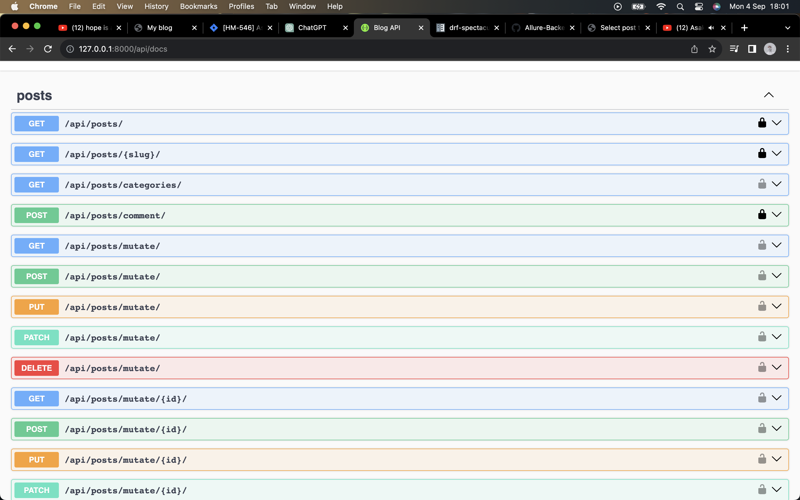

# Blog Application with Django and Django Rest Framework

This README provides an overview of the workflow of this blog application built using Django and Django Rest Framework (DRF). The application includes user management with authentication, user roles (regular user, author, publisher), and post management.

## User Roles

1. **Regular User:** These are users who are not authenticated. They can view published posts and comments.

2. **Authenticated User (Author):** Authenticated users have the role of an author. They can create, edit, and delete their posts and comments. They can also view published posts and comments.

3. **Publisher:** Publishers have the highest privileges. They can publish posts created by authors, edit or delete any post or comment, and manage user roles.

## Workflow

### Registration and Authentication

1. **User Registration:** A new user can register by providing their username, email, and password.

2. **User Authentication:** Users can log in using their credentials to access their account.

### User Management

1. **User Roles:** By default, users are regular users. Publishers can change the role of a user to "Author" or "Publisher."

2. **Author:** Authors can create, edit, and delete their own posts and comments.

3. **Publisher:** Publishers can manage user roles, publish posts created by authors, and have full control over posts and comments.

### Post Management

1. **Create a Post:** Authenticated users with the "Author" role can create new posts with a title and content.

2. **Edit/Delete a Post:** Authors can edit or delete their own posts. Publishers can edit or delete any post.

3. **Publish a Post:** Only publishers can publish posts created by authors. Once published, the post becomes visible to regular users.

### Commenting

1. **Add a Comment:** Authenticated users can add comments to any post.

2. **Edit/Delete a Comment:** Authors can edit or delete their own comments. Publishers can edit or delete any comment.

### Viewing Posts

1. **Regular Users:** Regular users can view published posts and comments.

2. **Authors:** Authors can view published posts and comments and can also access their own posts and comments.

3. **Publishers:** Publishers can view all posts and comments, published or not, and have full control over them.

## API Endpoints

visite the docs at - **User Registration:** `/api/docs/` (GET)

## Permissions and Authentication

- Authentication is required for most endpoints, except for registration and login.
- Use DRF's built-in permissions classes (e.g., `IsAuthenticated`, `IsAuthenticatedOrReadOnly`, custom permissions) to control access to specific views.

# Setting Up and Running a Python Django Application

This README file provides a detailed step-by-step guide to set up and run a Python Django application.

## Prerequisites

Before you start, ensure you have the following prerequisites installed on your system:

1. **Python (3.6 or higher):** [
2. **pip (Python package manager):**
3. **Virtualenv (recommended for creating isolated Python environments):** Install using `pip install virtualenv`

## Step 1: Create a Virtual Environment

```bash
# Create a virtual environment
virtualenv myenv

# Activate the virtual environment
# On Windows:
myenv\Scripts\activate
# On macOS and Linux:
source myenv/bin/activate
```

## Step 2: install the dependences and run the dev server

```bash
# install the requirements.txt
pip install -r requirements.txt

## migrate django models to the database
python manage.py migrate

# run the server on localhost:8000
python manage.py runserver
```

## step 3: Reading the docs and making http request

Navigate to `http://127.0.0.1:8000/api/docs` for documentatio, using any client of your choice, make a request to the endpoints provided in the docs

